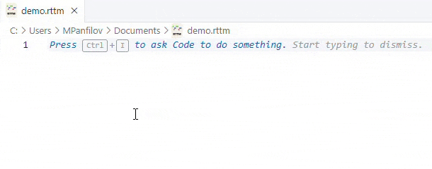

# RTTM Syntax Extension

> **Universal syntax highlighting support for RTTM (Rich Transcription Time Marked) files** in Visual Studio Code.

[](https://marketplace.visualstudio.com/items?itemName=z3r-dev.rttm-syntax-hl)
[](https://github.com/mxpanf/rttm-syntax-vscode/blob/main/LICENSE)

---

## Example



```rttm
SPEAKER CMU_001 1 0.00 5.24 <NA> <NA> spk1 <NA> <NA>
LEXEME CMU_001 1 0.10 0.40 hello lex spk1 0.97 <NA>
NON-SPEECH CMU_001 1 5.24 1.50 <NA> music <NA> <NA> <NA>
NOSCORE CMU_001 1 0.00 0.20 <NA> <NA> <NA> <NA> <NA>
SPKR-INFO CMU_001 <NA> <NA> <NA> <NA> adult_male spk1 <NA> <NA>
# End of file example
```

## About RTTM

[](https://m.z3r.io/rttm-format-specification-and-its-application)

RTTM (Rich Transcription Time Marked) is a standard text-based format used widely in audio annotation, speaker diarization, and automatic speech recognition (ASR).

An RTTM file consists of lines with exactly **10 space-separated fields**:

| #   | Field Name           | Description                                              | Typical Values                                |
|-----|----------------------|----------------------------------------------------------|-----------------------------------------------|
| 1   | **Type**             | Segment type                                             | `SPEAKER`, `LEXEME`, `NON-SPEECH`, `NOSCORE`, etc. |
| 2   | **File ID**          | File name (without extension)                            | e.g., `CMU_001`                               |
| 3   | **Channel ID**       | Audio channel (usually `1`)                              | `1`, `2`                                      |
| 4   | **Turn Onset**       | Segment onset (in seconds)                               | e.g., `130.430`                               |
| 5   | **Turn Duration**    | Segment duration (in seconds)                            | e.g., `2.350`                                 |
| 6   | **Orthography**      | Orthographic transcription or `<NA>`                     | word text, `<NA>`                             |
| 7   | **Subtype (stype)**  | Subtype of segment or `<NA>`                             | `male`, `female`, `child`, `lex`, `<NA>`      |
| 8   | **Speaker Name**     | Speaker identifier                                       | e.g., `spk1`, `<NA>`                          |
| 9   | **Confidence Score** | Confidence probability (0–1) or `<NA>`                   | `0.97`, `<NA>`                                |
| 10  | **Lookahead Time**   | Lookahead/prediction time or `<NA>`                      | e.g., `0.30`, `<NA>`                          |

> Fields marked as `<NA>` ("Not Applicable") represent optional or unspecified values.

---

## Features

- 🎨 Full syntax highlighting for all RTTM segment types:
  - **Segment Types** (`SPEAKER`, `LEXEME`, `NON-SPEECH`, `NOSCORE`, etc.)
  - **Speaker Information** (`male`, `female`, `child`, etc.)
  - **Timestamps** (`Turn Onset`, `Turn Duration`)
  - **Confidence and Lookahead Times**
- 📝 Comments (`#`) support
- 🚀 Universal grammar supporting all RTTM-compatible tools